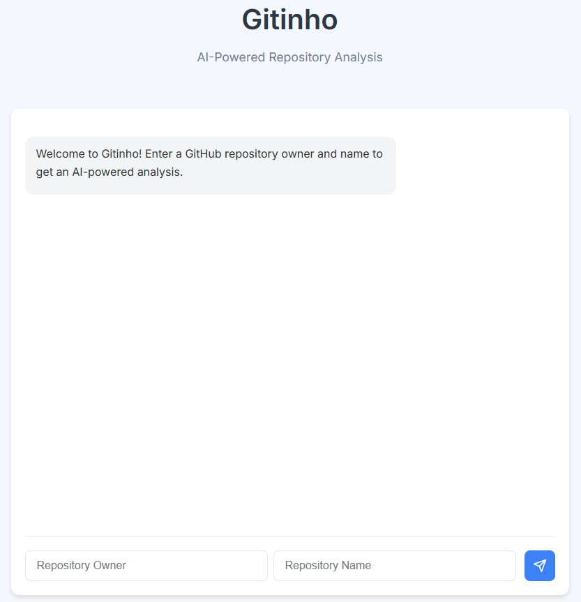

# Gitinho

Gitinho is an AI-powered GitHub repository analyzer that helps users understand repositories and their structure. It combines GitHub's API with OpenAI's capabilities to provide intelligent insights about repositories.

## Features

- Modern web interface with chat-like interaction
- Repository analysis using AI
- Detailed explanation of repository structure and purpose
- Integration with GitHub API for repository data fetching
- RESTful API endpoints for easy integration
- Markdown rendering support for better content display

## Prerequisites

- Node.js (v14 or higher)
- GitHub Personal Access Token
- OpenAI API Key

## Setup

1. Clone the repository:
   ```bash
   git clone https://github.com/yourusername/gitinho.git
   cd gitinho
   ```

2. Install dependencies:
   ```bash
   npm install
   ```

3. Create a `.env` file in the root directory with your credentials, use the .env.example file as a template:
   ```env
   GITHUB_TOKEN=your_github_token
   OPENAI_API_KEY=your_openai_api_key
   OPENAI_API_BASE_URL=your_openai_api_base_url_here
   PORT=3000
   ```

## Usage

1. Start the server:
   ```bash
   npm start
   ```

2. Access the Web Interface:
   - Open your web browser and navigate to `http://localhost:3000`
   - You'll be presented with a modern chat-like interface
   - Enter a GitHub repository URL or owner/repo combination to begin analysis

3. API Usage:
   To analyze a repository programmatically, send a POST request to `/analyze` endpoint:
   ```bash
   curl -X POST http://localhost:3000/analyze \
     -H "Content-Type: application/json" \
     -d '{"owner":"organization_name","repo":"repository_name"}'
   ```

## Web Interface

Gitinho provides a modern, intuitive web interface for analyzing GitHub repositories:



## API Endpoints

### Analyze Repository

```http
POST /analyze
Content-Type: application/json

{
  "owner": "organization_name",
  "repo": "repository_name"
}
```

Response:
```json
{
  "repository": "organization_name/repository_name",
  "analysis": "AI-generated analysis of the repository"
}
```

## Development

To run the application in development mode with hot reloading:

```bash
npm run dev
```

## License

This project is licensed under the MIT License - see the LICENSE file for details.